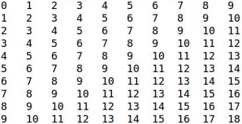
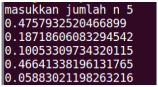

# tugas ini untuk melengkapi Pertemuan ke 7

## Kondisi dan perulangan


__Nama : NAHRUL WIJAYA__

__NIM : 312010415__

__Kelas : TI.20.A.1__

## Daftar Isi
| No | ISI | Link | Source Code |
| -- | --- | ---- | ----------- |
| 1. | Latihan 1 | [lihat](https://github.com/nahrulwijaya/project7-1/blob/main/README.md) | [Code](https://github.com/nahrulwijaya/project7-1/blob/main/hasil-1.py) |
| 2. | Latihan 2 | [lihat](https://github.com/nahrulwijaya/project7-1/blob/main/README.md)| [Code](https://github.com/nahrulwijaya/project7-1/blob/main/hasil-2.py) |

### Latihan 1 
* Saya diberikan tugas untuk membuat program perulangan bersarang/bertingkat (nested for) yang menghasilkan output berikut



Maka program yang saya buat sebagai berikut atau bisa dilihat di [Source Code](https://github.com/nahrulwijaya/project7-1/blob/main/hasil-1.py)

```python
baris = 10
kolom = baris

for bar in range(baris):
    for col in range(kolom):
        tab = bar+col
        print("{0:>5}".format(tab), end='')
    print()
```

Penjelasan

1. Pendeklarasian variable
```python
baris = 10
kolom = baris
```

2. Untuk perulangan baris dan kolom menggunakan `nested for`
```python
for bar in range(baris):
    for col in range(kolom):
        tab = bar+col        
```
3. Untuk menampikan hasil dari perulangan
     * Agar terlihat rapih menggunakan `format string` rata ke kanan sebanyak 5 karakter
     * Agar tidak membuat baris baru menggunakan `end=''` (baris)
     * Penggunaan `print()` untuk membuat baris baru (kolom)
```python
  print("{0:>5}".format(tab), end='')
print()    
```

Maka program yang di hasil seperti berikut


### Latihan 2

* Saya diberikan tugas untuk membuat program :
     * Tampilkan n bilangan acak yang lebih kecil dari 0.5
     * Nilai n diisi pada saat runtime
     
Seperti pada gambar berikut




Maka program yang saya buat sebagai berikut atau bisa dilihat di [Source Code](https://github.com/nahrulwijaya/project7-1/blob/main/hasil-2.py)

```python
import random
print(39*"=")
print("Bilangan acak yang lebih kecil dari 0,5")
print(39*"=")
jum = int( input("Masukan nilai n : "))
i = 0
for i in range(jum):
    i += 1
    angkaDec = random.uniform(0, 0.5)
    print("Data ke", i, " = ", angkaDec)
 
 ```

Penjelasan

1. Mengimport module `random` untuk membuat bilangan acak
```python
import random
```

2. Untuk menentukan jumlah input yang diinginkan dan dikonversi ke dalam bilangan bulat (integer) yang dimasukan ke variable `jum`
```python
jum = int( input("Masukan nilai n : "))
```

3. Untuk pengulangan range yang diinputkan oleh variable `jum`
```python
for i in range(jum):
```

4. Untuk menampilkan urutan data sesuai jumlah inputan dengan hasil di bawah 0.5
```python
angkaDec = random.uniform(0, 0.5)
    print("Data ke", i, " = ", angkaDec)
```

Maka program yang dihasilkan akan seperti berikut


